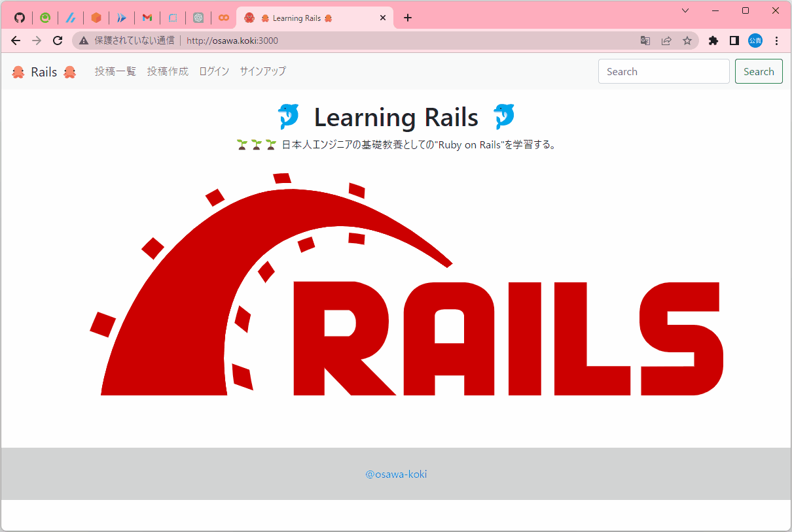

# learning-ruby_on_rails

🌱🌱🌱 日本人エンジニアの基礎教養としての"Ruby on Rails"を学習する。  

基礎的な部分とよく使用しそうなユーザ認証をDeviseを使用して実装する。  

以下の2つの技術を使用する。  

- Ruby on Rails
- PostgreSQL

  

> **Warning**  
> あくまでも"Ruby on Rails"に触れることを目的としているため、セキュリティ対策は未実装です。  
> 具体的にはXSS攻撃の脆弱性やユーザの入力値の未検証などの問題点があります。  

## 実行方法

以下のコマンドを順に実行する。  

```shell
docker compose up db -d [--build]
docker compose up web -d [--build]
```

`docker compose up db -d`コマンドでPostgreSQLデータベースを作成。  
これを実行した段階で、ローカル(ホスト)マシンに接続しているため、ローカルからデータベースにアクセス可能。  

| 設定 | 設定値 |
| ---- | ---- |
| host | localhost |
| port | 5432 |
| user | rails_study |
| password | password |

---

次に、`docker compose up web -d`を実行する。  
これでRailsサーバが立ち上がる。  

## 自分用メモ

初回時は`docker-compose run web rails new . --force --no-deps --database=postgresql`コマンドで、イロイロなデータを作成した。  

```shell
# モデルの作成
rails generate model <モデル名> カラム名:データ型 カラム名:データ型 カラム名:データ型
# docker-compose run web rails generate model <モデル名> カラム名:データ型 カラム名:データ型 カラム名:データ型

# コントローラの作成
rails generate controller <コントローラ名> <メソッド名>
# docker-compose run web rails generate controller <コントローラ名> <メソッド名>
```

マイグレーションをするには、、、  

```shell
rails db:migrate RAILS_ENV=development
# docker compose run web rails db:migrate RAILS_ENV=development
```
